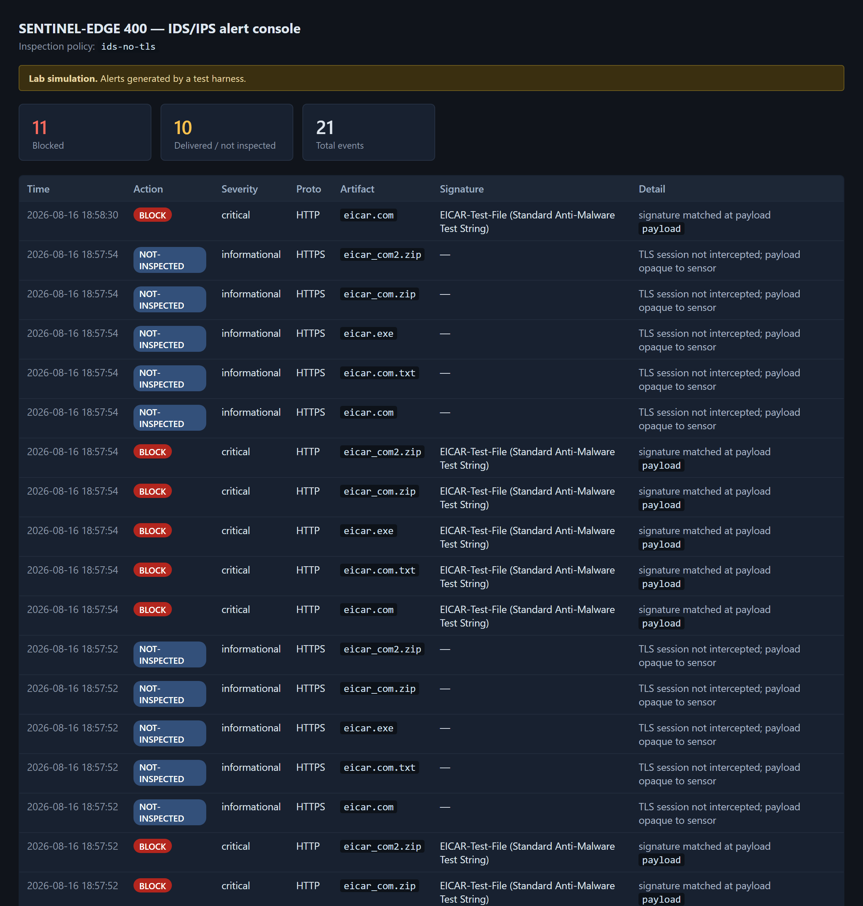
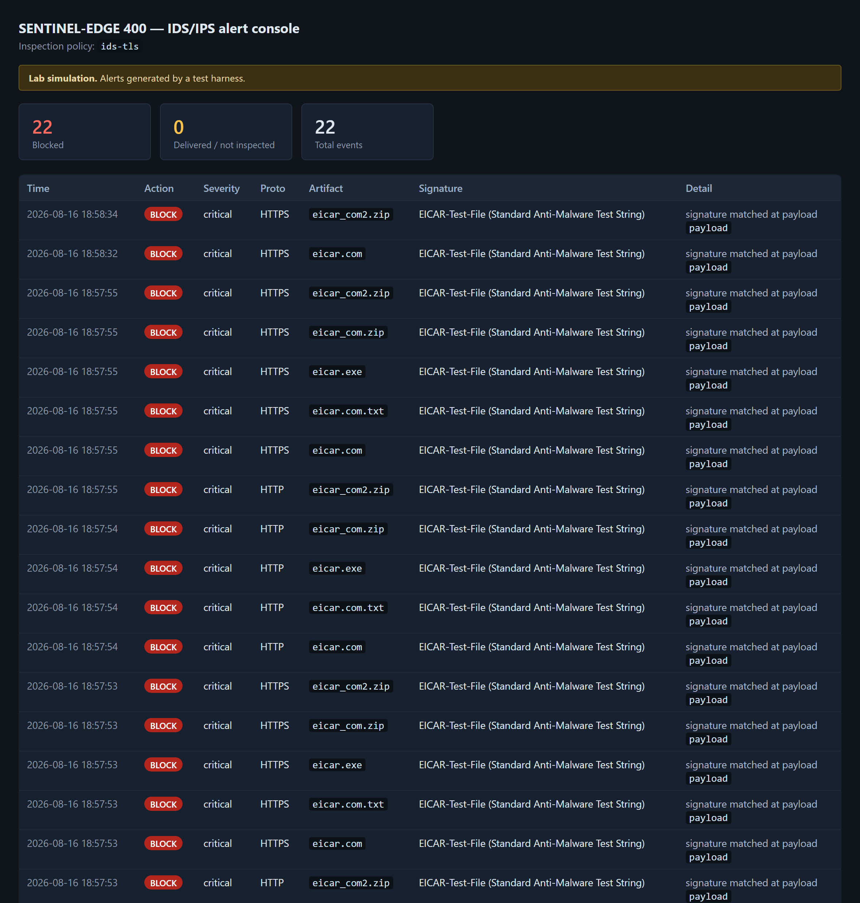
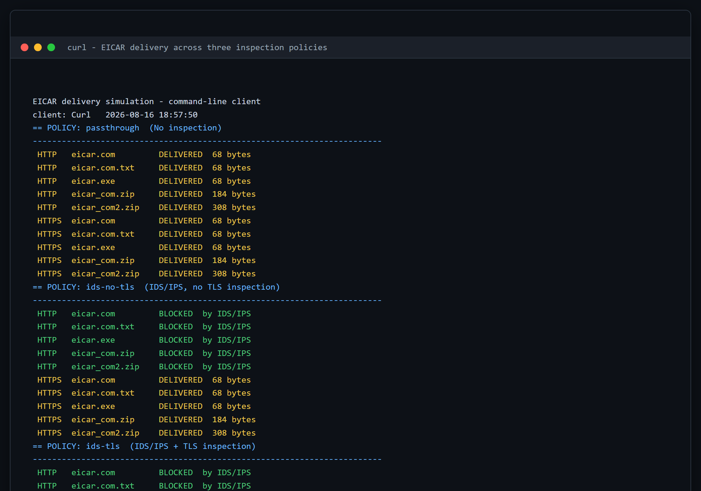
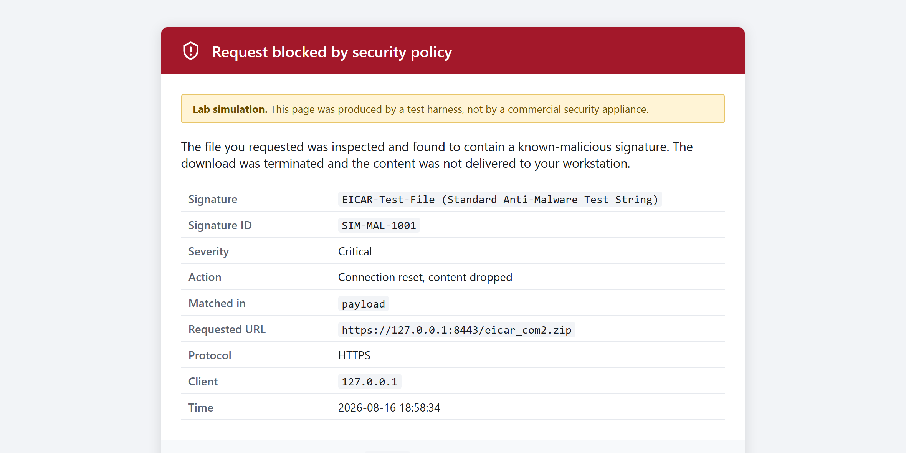

# EICAR Control Validation Suite

Prove your anti-malware controls are actually *looking* — not just installed.

A modular suite that validates **network IDS/IPS, network AV and host-based AV**
using the EICAR standard anti-malware test file, plus a working gateway simulation
that shows how the same payload behaves under four different inspection postures.

> **Stub repository.** This repo documents the project. The source is not
> published — see [Why the source isn't here](#why-the-source-isnt-here).

📖 **Full write-up:** <https://failclosed.com/2026-08-16-eicar-control-validation-suite/>

---

## The finding

Three inspection policies, five artifacts each, over both protocols. The only number
that matters is how many payloads reached the endpoint.

| Inspection policy | Cleartext HTTP | TLS |
|---|---|---|
| No inspection | 5/5 delivered | 5/5 delivered |
| **IDS/IPS, no TLS interception** | **0/5 delivered** | **5/5 delivered** |
| IDS/IPS + TLS interception | 0/5 delivered | 0/5 delivered |

The middle row is the whole project.

That sensor has a **100% block rate on everything it inspected.** Its dashboard is
green. It also passed every single payload that arrived over TLS — which, in any
environment resembling the modern web, is all of them.

This is not a broken sensor. It is a correctly functioning sensor pointed at the
wrong 5% of the traffic, and the metric it reports cannot distinguish that from
success.



Look at the severity column. The blocks are `critical`. The misses are
`informational` — exactly what gets filtered out of a SOC view, rolled into a daily
digest, or never alerted on at all.

**The sensor is telling the truth about its own blindness, in the one severity class
nobody reads.**

Turn interception on and the same requests resolve very differently:



The delta between those two screenshots is not detection capability. The signature was
always loaded, always correct, always matching. The delta is **visibility**.

---

## Why EICAR

EICAR is the least impressive payload in existence: 68 printable ASCII characters, no
execution, no persistence. Every anti-malware product is expected to detect it, and
detecting it proves nothing about how good an engine is.

That is what makes it useful. **EICAR does not measure whether your engine is smart.
It measures whether it is looking.**



No evasion, no obfuscation, default user agent.

---

## What the suite tests

Three modules, each of which runs standalone or together.

**Egress** pulls the four published artifacts from `secure.eicar.org` over both
protocols. There is a trap here that invalidates the obvious approach: eicar.org
answers plain HTTP with a 301 to HTTPS, so the payload never crosses the wire in
cleartext when sourced upstream. **A cleartext IDS test sourced from eicar.org is
inconclusive by construction**, and a pass obtained that way means nothing.

**Controlled origin** exists because of that trap. It serves byte-exact artifacts over
genuine cleartext HTTP and TLS from an origin you control, with Serve and Fetch modes
so the origin and client can sit on opposite sides of the sensor. It also serves
`eicar.exe`, the same 68 bytes under a PE extension, which EICAR does not publish
upstream.

**Host AV** characterises the endpoint agent across detection *stages* rather than
asking a single yes or no: posture, extension handling, archive handling, extraction,
on-demand scan, and AMSI.

Verdicts are recorded **per layer**, because collapsing them hides the finding:

| Verdict | Layer | Meaning |
|---|---|---|
| `Blocked` | Network | A device stopped or substituted the transfer — good |
| `Allowed` | Network | Delivered intact and hash verified — a gap |
| `Quarantined` | Host | Removed, read denied, or convicted per AV telemetry — good |
| `Persisted` | Host | Remained on disk and re-read byte for byte intact — a gap |

The case worth escalating is anything that is both `Allowed` **and** `Persisted`.

---

## Container handling

Two of the five artifacts are containers: EICAR inside a ZIP, and that ZIP inside
another ZIP. Container handling is where implementations genuinely diverge.



A sensor that stops at depth one passes that file. One that recurses catches it. The
only way to know which you have is to send it.

**The endpoint told a more interesting story**, and this part is real measurement
rather than simulation. Against Microsoft Defender on one Windows 10 host:

- The raw 68-byte file was convicted in roughly **two seconds** under every extension
  tested — `.com`, `.txt`, `.exe`, `.dll`, `.js`. Detection is content based, so
  **renaming a file buys an attacker nothing.**
- The same payload inside a ZIP sat on disk untouched **past twenty seconds** with no
  detection telemetry at all.
- Extraction of the single-layer archive was then denied outright, and an explicit
  on-demand scan convicted everything.

Archive members are inspected **on access and on demand, not on write.** That is not
a bug — deep scanning every container on write is expensive and most products trade
it away deliberately. The residual risk is **dwell time and propagation**, not
execution: a malicious archive can sit on a file share, replicate into a backup set,
and sync onward for as long as nobody opens it.

---

## Detection

Signature detection for EICAR is trivial, and *how the rule has to be written* is the
instructive part:

```
alert http any any -> any any (msg:"EICAR test file in cleartext HTTP response body"; \
  flow:established,to_client; file_data; \
  content:"X5O!P%@AP[4\PZX54(P^)7CC)7}$EICAR"; \
  content:"-STANDARD-ANTIVIRUS-TEST-FILE!$H+H*"; distance:0; within:35; \
  classtype:policy-violation; sid:1000010; rev:1;)
```

That is split across two `content:` matches with a `distance`/`within` constraint
rather than one. Functionally identical. It is written that way so the rule file does
not itself contain the contiguous signature and get quarantined by the AV running on
the sensor you are deploying it to.

That rule works, and as a general detection it is close to worthless. **Nothing that
is actually trying will ever send you EICAR.** It is a positive control for your
pipeline and nothing more.

**The durable signal is not a payload signature at all.** It is the coverage ratio:

```
count of NOT-INSPECTED events / count of inspected events, per egress path, over time
```

That number is the one thing here that generalises. It does not care about EICAR or
any particular malware family, and **it cannot be evaded by an attacker**, because it
measures your own sensor's admission that it could not see. If it is climbing, or if
it dwarfs your inspected volume, that ratio *is* the finding — and no block-rate
metric computed over inspected traffic will ever surface it.

A block rate measured only over the traffic you inspected is a measure of your
inspection, not of your coverage.

---

## Why the source isn't here

This repository is a stub: description, screenshots and detection guidance, with no
implementation.

The detection material is the part with public value and it is complete above. The
coverage-ratio metric is the durable finding, and it requires none of this code —
it comes from telemetry you already have.

The suite itself writes the EICAR string to disk and pushes it across networks by
design. That is safe and sanctioned when run deliberately against systems you are
authorized to test, and considerably less so as a ready-to-run download that ends up
executed on a network nobody scoped. Anyone who needs it can rebuild it from the
methodology described in the write-up.

The one non-obvious implementation detail worth stating publicly, because getting it
wrong produces confident false findings: **endpoint agents raise detection events
synchronously on write but remediate asynchronously.** A check that samples disk
presence once will report convicted artifacts as undetected. Poll disk presence,
read-back success and AV telemetry concurrently until one of them fires. The
read-back is the decisive signal, because a file that cannot be read cannot be
executed regardless of whether its directory entry has been unlinked yet.

---

## A note on the simulation

The gateway shown in these screenshots is a **simulation**. It genuinely scans
response bodies, recurses into ZIP containers, blocks, and writes alerts — the
inspection is real and the screenshots are live renders of it running.

It is **not** a commercial security product, does not imitate one, and its appliance
name is invented. Every page it serves is marked as a lab simulation. These images
must not be presented as output from a vendor appliance.

The endpoint measurements are real, from a single Windows 10 host with real-time
protection enabled and current signatures. One host is one data point, not a product
review.

---

## Authorized use only

This project is made available for lawful and authorized purposes only. Use it only
on systems you own or for which you have explicit written authorization from the
owner. It is intended for security research and education, academic use, authorized
penetration testing and security assessment.

EICAR is harmless but it is **not quiet.** It will light up your AV console, your
SIEM, and somebody's on-call queue. Tell the monitoring team first, unless a blind
detection test is the actual objective — in which case tell whoever authorized it, so
the alerts are attributable to you.

Test output is sensitive: reports contain hostnames, agent versions, signature
versions and exclusion configuration, which is useful reconnaissance in the wrong
hands.

## License

Documentation and screenshots in this repository are released under
[CC BY 4.0](https://creativecommons.org/licenses/by/4.0/). No source code is
included or licensed.

The EICAR test file is published by the
[European Institute for Computer Antivirus Research](https://www.eicar.org/download-anti-malware-testfile/).

