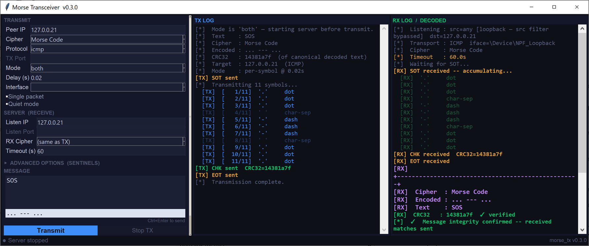
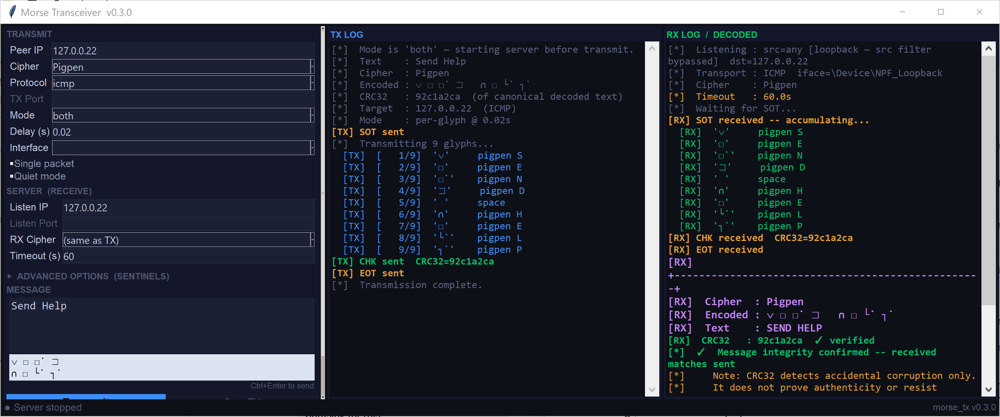
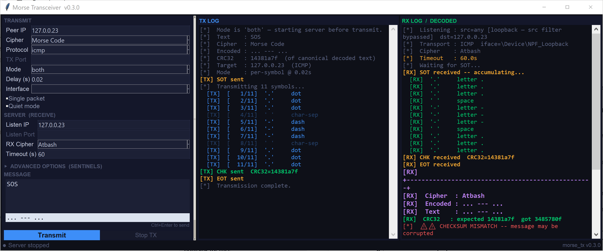

# Morse Code Packet Transceiver

Sends a text message across a network one symbol at a time, with each dot, dash and
separator travelling in its own ICMP echo request, TCP segment or UDP datagram.

**A dot is a packet. A dash is a packet. The gap between words is a packet.**

It is a terrible way to move data and an excellent way to *look* at data moving.
That is the entire point.

> **Stub repository.** This repo documents the project. The source is not
> published — see [Why the source isn't here](#why-the-source-isnt-here).

📖 **Full write-up:** <https://failclosed.com/2026-08-16-morse-code-packet-transceiver/>

---



*A complete ICMP session. `SOS` becomes eleven symbol packets plus three framing
packets, and the receiver reassembles and verifies it.*

---

## What it does

Every transmission is framed by sentinel packets:

```
SOT  ->  unit  unit  unit ...  ->  CHK  ->  EOT
```

The receiver runs a sniffer and ignores everything until it sees a
start-of-transmission sentinel, then accumulates units until the
end-of-transmission sentinel arrives. Anything outside that window is discarded, so
unrelated traffic on the same protocol and port does not corrupt a session.

Between the data and the EOT sits a CHK packet carrying a CRC32 of the message,
computed over the canonically decoded text so both ends normalise the same way
before hashing.

Four encodings change what actually goes on the wire, not just how the log renders:

| Cipher | Wire form | Packets per character |
|---|---|---|
| Morse Code | dot, dash, separator | about 3.6 |
| Pigpen | Unicode glyphs | 1 |
| Atbash | Letters, A to Z reversed | 1 |
| None | Plaintext | 1 |

Morse is by far the loudest. A fourteen character message becomes 48 symbol packets
plus three framing packets — roughly fifteen seconds of continuous traffic at the
default pacing to move fourteen characters.



Both ends must agree on the cipher. There is no negotiation, so a mismatch produces
nonsense and fails the checksum — a loud failure rather than a silent one.



---

## What this is not

**This is not a covert channel**, and it is worth saying plainly rather than letting
the Red Team label imply otherwise.

A tool built to evade detection would pad payloads to look like normal traffic,
randomise its timing, avoid fixed markers, and move as few packets as possible. This
does the opposite of all four. It emits a fixed byte sequence at the start and end of
every session, uses a hardcoded ICMP identifier, sends one packet per symbol on a
metronome, and generates roughly fifty packets to move a short sentence.

Every one of those choices was made for **visibility**.

That makes it useful for something more practical than evasion: it is a generator for
traffic a detection *should* catch, which means you can use it to find out whether
yours does.

---

## Detection

Two levels, and the difference between them is the reason this project exists.

**The easy level is content matching.** The default sentinels and ICMP identifier are
fixed values:

| Artifact | Value | Size |
|---|---|---|
| SOT sentinel | `\xfe\xfeMORSE:SOT\xfe\xfe` | 13 bytes |
| EOT sentinel | `\xfe\xfeMORSE:EOT\xfe\xfe` | 13 bytes |
| CHK prefix | `\xfe\xfeMORSE:CHK:` | 22 bytes with checksum |
| ICMP identifier | `0xBEEF` (48879) | |
| TCP/UDP source port | 9999 | |

```
alert icmp any any -> any any (msg:"Morse Packet Transceiver SOT sentinel"; \
  itype:8; content:"|fe fe|MORSE:SOT|fe fe|"; \
  classtype:policy-violation; sid:1000001; rev:1;)
```

That rule works and is close to worthless as a general detection, because every one
of those values is configurable. A signature keyed to the default strings catches
only the person who did not change them.

**The durable level is behavioural.** What survives a sentinel change is the shape of
the traffic:

- **Payload sizes.** Every symbol packet carries a single byte. A one-byte ICMP echo
  payload is strange on any network — normal Windows ping carries 32 bytes of
  padding, Linux 56.
- **Volume and regularity.** Dozens to hundreds of evenly spaced echo requests to a
  single destination is not what host-to-host ping traffic looks like.
- **Payload contents that are not padding.** Legitimate echo requests repeat the same
  padding every time, so a session where consecutive payloads differ is worth a look
  on its own.

```
alert icmp any any -> any any (msg:"Repeated single-byte ICMP echo payloads, possible per-symbol data channel"; \
  itype:8; dsize:1; threshold:type both, track by_src, count 30, seconds 60; \
  classtype:policy-violation; sid:1000002; rev:1;)
```

The second rule is the one worth keeping. It does not care about Morse, or about this
tool at all, and will fire on anything that tries to move data one small unit at a
time through echo requests.

Signatures pinned to a specific tool's constants are cheap to write and cheap to
evade. Detections built on what a technique *forces* the traffic to look like are
harder to write and considerably harder to get around, because the attacker cannot
change them without giving up the thing they were trying to do.

---

## Why the source isn't here

This repository is a stub: description, screenshots and detection guidance, with no
implementation.

The detection material is the part with public value, and it is complete above — the
behavioural rule works against anything built along these lines, not just this tool.
The implementation adds nothing a defender needs, and a working per-symbol
exfiltration harness is not something worth handing out ready to run.

If you want to test whether your sensors catch this class of traffic, the second
Suricata rule and the traffic characteristics above are enough to build your own
generator in an afternoon.

---

## Authorized use only

This project is made available for lawful and authorized purposes only. Use it only
on systems you own or for which you have explicit written authorization from the
owner. It is intended for security research and education, academic use, authorized
penetration testing and security assessment.

Unauthorized access to, use of, or interception of traffic from systems you do not
own may be a criminal offence. Determining whether a given use is lawful is the
responsibility of the user.

## License

Documentation and screenshots in this repository are released under
[CC BY 4.0](https://creativecommons.org/licenses/by/4.0/). No source code is
included or licensed.

