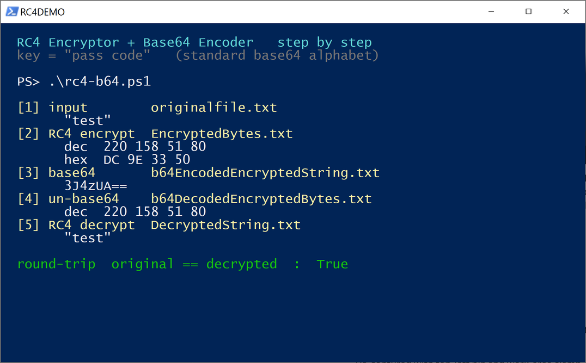
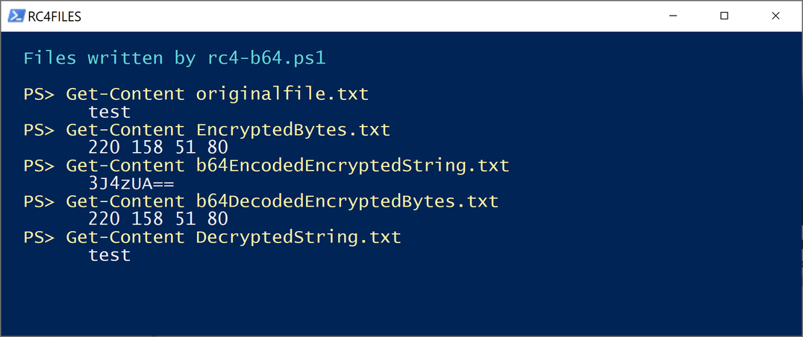

# RC4 Encryptor and Base64 Encoder

A small PowerShell project that RC4 encrypts a file, base64 encodes the result, and
can optionally push the base64 through a swapped alphabet on the way out. Run it in
reverse with the same key and you get the original file back.

It is old, it is simple, and it does exactly what the name says. It is documented
here as a Red Team piece for two reasons, and **neither of them is that you should
reach for it on an engagement.**

> **Stub repository.** This repo documents the project. The source is not
> published — see [Why the source isn't here](#why-the-source-isnt-here).

📖 **Full write-up:** <https://failclosed.com/2026-08-16-rc4-encryptor-base64-encoder/>

---

## Why it is interesting

**RC4 plus base64 plus PowerShell is the canonical shape of a loader.** A benign
implementation makes a clean specimen for talking about why that shape gets caught.

**It is a tidy example of the difference between obfuscation and encryption** — a
distinction that matters a great deal more on the offensive side than people new to
it tend to assume.

---

## The first thing that happens

Before getting to any of the cryptography, the interesting behaviour showed up on the
very first run. On an up-to-date Windows 10 box with Microsoft Defender at its
defaults, the script would not execute:

```
& : Operation did not complete successfully because the file
    contains a virus or potentially unwanted software.
```

Defender had quarantined it, and the detection was not generic:

```
Threat   : TrojanDropper:PowerShell/Cobacis.B
Resource : ...\rc4-b64.ps1
```

A roughly decade-old educational script, openly credited to two named authors, trips
a Cobalt Strike adjacent dropper signature on sight. That is not a false positive in
the usual sense. Defender is matching the *structure* of the code, and the structure
of the code is genuinely the structure of a stager: a byte array key, a 256 iteration
key schedule, an XOR keystream loop, and base64 on the output.

**The pattern is the payload as far as detection is concerned.** That is the whole
lesson in miniature.

---

## What it actually does



The pipeline:

1. Read the file into a byte array.
2. RC4 encrypt it with a key, hardcoded in the script as the string `pass code`.
3. Base64 encode the encrypted bytes.
4. Optionally run the base64 text through a substitution that swaps the standard
   alphabet for a reordered one.

Each stage is written to its own file on disk, so the whole transformation can be
inspected byte by byte:



The optional alphabet swap maps `A-Za-z0-9+/` onto a reordered version of itself.
Turning it on for the same input gives `T9UPk0==` instead of `3J4zUA==`. **The
underlying ciphertext bytes are identical.** All that changed is which base64
characters represent them.

---

## Obfuscation is not encryption

This is where the offensive relevance turns into a cautionary tale, because it is
easy to look at "RC4 encrypted and base64 encoded with a custom alphabet" and read it
as three layers of protection.

It is **one** layer, and a weak one, wrapped in two layers of reversible encoding.

**The custom alphabet adds nothing.** A one-to-one remapping of the base64 characters
is a monoalphabetic substitution. There is no key. The substitution table sits in
plaintext in the script anyway. It slows down a casual glance and nothing more.

**Base64 is not encryption at all.** It is an encoding — reversible by definition and
by design. Obvious when stated plainly, and one of the most commonly mislabelled
things in the field.

**The RC4 layer is the only cryptography here, and it is used in the weakest possible
way.** Two problems compound:

*The key is hardcoded.* Every copy encrypts with the string `pass code`, so the key
is not secret from anyone who has the script — which is anyone you sent an encrypted
file to.

*The key is fixed with no IV or nonce*, so every file is encrypted under the
identical keystream. RC4 is a stream cipher, and reusing a keystream across two
messages is the many-time-pad failure — catastrophic rather than gradual. XOR two
ciphertexts together and the keystream cancels, leaving the XOR of the two
plaintexts:

```
C1 xor C2 == P1 xor P2      : True
given P1 = "ATTACK AT DAWN"
recovered P2                : RETREAT NOW!!!
```

No key was needed to pull the second message out. That is not an implementation bug
in this script specifically — it is what happens to any stream cipher used with a
static key and no per-message randomness.

RC4 on top of that is simply retired. It was prohibited in TLS by
[RFC 7465](https://www.rfc-editor.org/rfc/rfc7465) in 2015 over its keystream biases,
the same statistical leaks that made the early WEP attacks work.

None of this makes the script bad at what it is, which is a demonstration. It makes it
a good illustration of a trap: **layering reversible encodings around one weak cipher
and mistaking the total for strength.**

---

## Detection

The useful question is not how to catch this exact script, which Defender already
does by name, but how to catch the pattern when the constants have been changed and
the signature no longer matches.

**AMSI is doing the real work.** Since PowerShell 4, script content is handed to the
Antimalware Scan Interface at runtime, *after* any encoding or wrapping has been
unwound in memory, and Defender's `Cobacis` family matches the RC4 loop structure
there. That is why renaming the file or reshuffling the base64 alphabet would not
help an attacker — AMSI sees the deobfuscated body, not the file on disk. Confirm
AMSI is enabled and unbypassed on your endpoints, because a working AMSI bypass is
what turns this from "blocked on sight" into "runs silently".

**Script block logging is the durable telemetry.** PowerShell event ID 4104 records
the deobfuscated content of what actually ran. Enable it by policy and ship it to
your SIEM. It survives obfuscation for the same reason AMSI does.

**The behavioural shape is signature independent.** Hunt on what the technique
structurally has to do:

- byte array manipulation with a 256 element state array and modulo 256 arithmetic —
  the fingerprint of RC4 or a similar hand-rolled cipher in a script
- base64 encode or decode calls sitting next to XOR loops
- reading a file, transforming it, and writing an encoded blob back to disk

**Do not treat execution policy as a control.** It is a guardrail against accidental
double-clicks, trivially sidestepped with a flag. Watching for changes to it is more
useful than relying on it.

The attacker cannot remove the RC4 loop or the base64 without ceasing to do the thing
the tool exists to do, and AMSI and script block logging both see straight through the
wrapping to that structure.

---

## Why the source isn't here

This repository is a stub: description, screenshots and detection guidance, with no
implementation.

There is no reason to publish another copy. The RC4 function is Remko Weijnen's and
the alphabet translation is Doug Finke's, both used with permission and credited in
the write-up; the original implementations remain theirs to distribute. What this
project contributed was the analysis, and that is reproduced in full above.

More to the point, the cryptography here provides **no meaningful confidentiality**,
and a ready-to-run RC4-plus-base64 PowerShell loader is not a useful thing to hand
out — as Defender's own verdict on it demonstrates.

---

## Authorized use only

This project is made available for lawful and authorized purposes only. Use it only
on systems you own or for which you have explicit written authorization from the
owner. It is intended for security research and education, academic use, authorized
penetration testing and security assessment.

Unauthorized access to or use of systems you do not own may be a criminal offence.
Determining whether a given use is lawful is the responsibility of the user.

**RC4 and the reversible encodings described here provide no meaningful
confidentiality. Do not use them to protect anything that actually needs
protecting.**

## License

Documentation and screenshots in this repository are released under
[CC BY 4.0](https://creativecommons.org/licenses/by/4.0/). No source code is
included or licensed.

